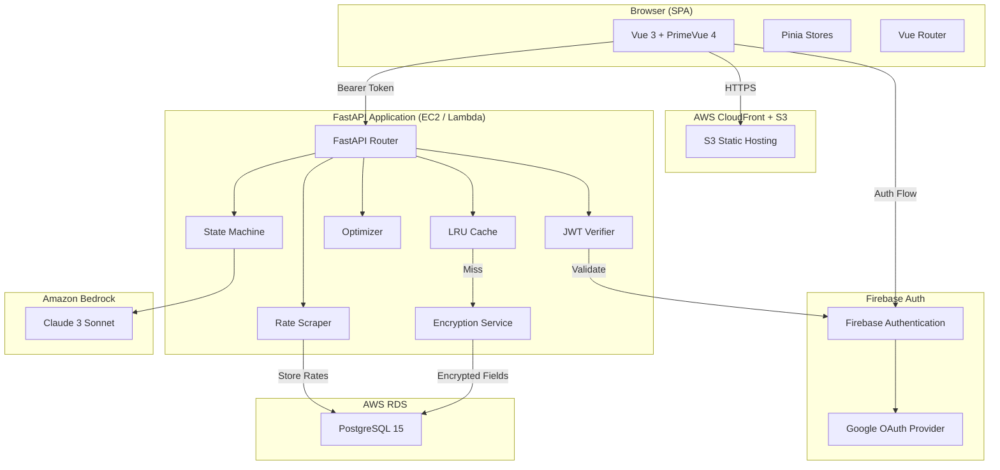
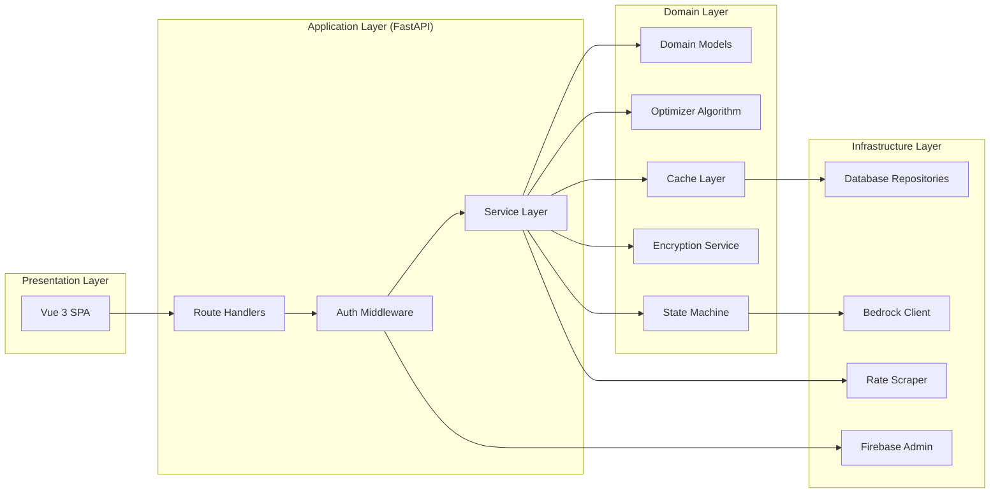
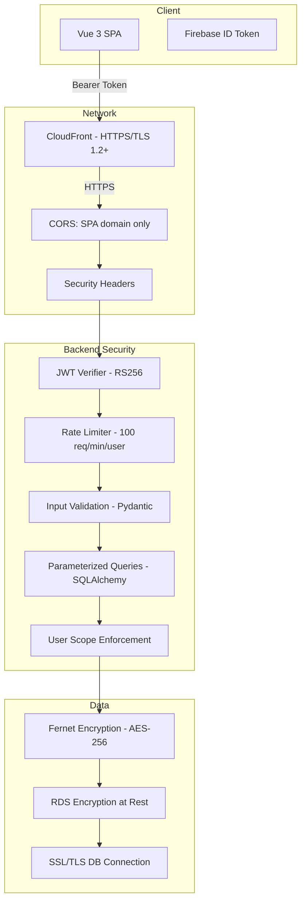
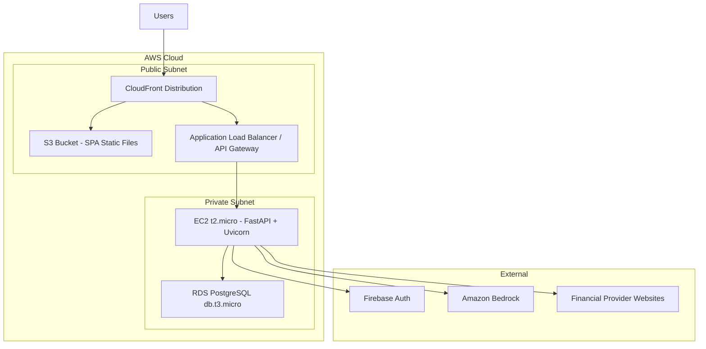

# Design Document — Finalat Platform

## Overview

Finalat is a full-stack personal finance management and AI-powered investment advisory platform targeting Mexican individual investors. The system combines a Vue 3 SPA frontend with a FastAPI Python backend, PostgreSQL database, Firebase Authentication, Amazon Bedrock AI integration, and field-level AES-256 encryption for sensitive financial data.

### Key Design Goals

- **Security-first**: Field-level encryption (Fernet/AES-256) for all monetary data at rest, JWT-based auth, parameterized queries
- **Performance**: In-memory LRU cache (500 entries, 5-min TTL), lazy-loaded routes, sub-2s API responses
- **User experience**: Spanish (es-MX) locale, dark mode, accessible (WCAG 2.1 AA), responsive
- **Cost-efficient**: AWS Free Tier deployment (S3+CloudFront, EC2 t2.micro or Lambda, RDS db.t3.micro)
- **AI-guided advisory**: Deterministic state machine driving a natural-language conversation via Amazon Bedrock (Claude)

### Technology Stack

| Layer | Technology |
|-------|-----------|
| Frontend | Vue 3 (Composition API), Vue Router, Pinia, Tailwind CSS, PrimeVue 4, Vite, TypeScript |
| Backend | FastAPI (Python 3.13), Uvicorn, SQLAlchemy 2.0, Pydantic v2 |
| Database | PostgreSQL 15 (RDS) / SQLite (local dev fallback) |
| Auth | Firebase Authentication (email/password + Google OAuth) |
| AI | Amazon Bedrock (Claude 3 Sonnet) |
| Encryption | cryptography (Fernet — AES-256-CBC + HMAC-SHA256) |
| CI/CD | GitHub Actions |
| Hosting | AWS S3 + CloudFront (SPA), EC2 t2.micro or Lambda (API), RDS (DB) |

---

## Architecture

### High-Level System Architecture



### Request Flow

1. User authenticates via Firebase Auth (email/password or Google OAuth)
2. SPA receives Firebase ID token (RS256 JWT)
3. SPA attaches token as `Authorization: Bearer <token>` on all API calls
4. FastAPI middleware validates JWT against Google's public X.509 certificates
5. Middleware extracts `user_id` (Firebase UID) and injects into request context
6. Route handler executes business logic, scoped to `user_id`
7. Encryption Service encrypts/decrypts monetary fields transparently
8. LRU Cache intercepts reads; invalidated on writes
9. Response returned in standard JSON envelope

---

### Layered Architecture



---

## Components and Interfaces

### Backend Component Hierarchy

```
backend/
├── main.py                    # FastAPI app entry, CORS, startup/shutdown
├── config.py                  # Settings via Pydantic BaseSettings
├── middleware/
│   ├── auth.py               # JWT verification middleware
│   └── rate_limiter.py       # Per-user rate limiting (100 req/min)
├── routers/
│   ├── auth.py               # /api/auth (login, register proxy)
│   ├── ahorro.py             # /api/ahorro CRUD
│   ├── creditos.py           # /api/creditos CRUD
│   ├── gastos_ingresos.py    # /api/gastos-ingresos CRUD
│   ├── deudas.py             # /api/deudas CRUD
│   ├── aportaciones.py       # /api/aportaciones CRUD
│   ├── afore.py              # /api/afore CRUD
│   ├── gbm.py                # /api/gbm upload + CRUD
│   ├── categories.py         # /api/categories CRUD
│   ├── instruments.py        # /api/instruments (read, admin scrape)
│   ├── courses.py            # /api/courses + /api/lessons
│   ├── advisor.py            # /api/advisor (Fina chat)
│   └── update_tracker.py     # /api/update-tracker
├── services/
│   ├── encryption.py         # Fernet encrypt/decrypt
│   ├── cache.py              # LRU cache with TTL
│   ├── optimizer.py          # Greedy allocation algorithm
│   ├── state_machine.py      # Deterministic conversation FSM
│   ├── bedrock_client.py     # Amazon Bedrock integration
│   ├── rate_scraper.py       # Instrument rate scraping
│   └── update_tracker.py     # Module update timestamps
├── models/
│   ├── database.py           # SQLAlchemy engine + session
│   ├── user.py               # User model
│   ├── ahorro.py             # Savings model
│   ├── creditos.py           # Credit cards model
│   ├── gastos_ingresos.py    # Expenses/income model
│   ├── deudas.py             # Debts model
│   ├── aportaciones.py       # Contributions model
│   ├── afore.py              # Pension model
│   ├── gbm_portfolio.py      # GBM portfolio model
│   ├── categories.py         # Categories model
│   ├── instruments.py        # Instruments model
│   ├── courses.py            # Courses + Lessons models
│   ├── conversation.py       # Conversation session model
│   └── update_tracker.py     # Update tracker model
├── schemas/
│   ├── common.py             # APIResponse envelope schema
│   └── ...                   # Pydantic request/response schemas per module
└── utils/
    ├── response.py           # Standard response builder
    └── validators.py         # Shared validation helpers
```

### Frontend Component Hierarchy

```
frontend/src/
├── main.ts                     # App bootstrap
├── App.vue                     # Root component
├── router/
│   └── index.ts               # Vue Router config with guards
├── stores/
│   ├── auth.ts                # authStore (Pinia)
│   ├── finance.ts             # financeStore (Pinia)
│   ├── advisor.ts             # advisorStore (Pinia)
│   └── learning.ts            # learningStore (Pinia)
├── composables/
│   ├── useAuth.ts             # Firebase auth composable
│   ├── useApi.ts              # Axios instance + interceptors
│   └── useTheme.ts            # Dark mode toggle
├── layouts/
│   ├── DefaultLayout.vue      # TopNav + MainContent (public)
│   └── DashboardLayout.vue    # TopNav + Sidebar + MainContent
├── components/
│   ├── layout/
│   │   ├── TopNav.vue         # Fixed 64px top navigation
│   │   ├── Sidebar.vue        # 200-280px collapsible sidebar
│   │   └── MainContent.vue    # Content area wrapper
│   ├── ui/
│   │   ├── LoadingSpinner.vue
│   │   ├── ErrorAlert.vue
│   │   ├── ConfirmDialog.vue
│   │   ├── DataTable.vue      # Paginated table (50 items/page)
│   │   └── CurrencyInput.vue  # es-MX formatted money input
│   ├── charts/
│   │   └── FinanceChart.vue   # Bar/line chart wrapper
│   └── advisor/
│       ├── ChatWindow.vue     # Fina conversation UI
│       └── ChatMessage.vue    # Individual message bubble
├── pages/
│   ├── LoginPage.vue
│   ├── RegisterPage.vue
│   ├── HomePage.vue
│   ├── finanzas/
│   │   ├── FinanzasPage.vue   # Dashboard root
│   │   ├── AhorroPage.vue
│   │   ├── CreditosPage.vue
│   │   ├── GastosIngresosPage.vue
│   │   ├── DeudasPage.vue
│   │   ├── AportacionesPage.vue
│   │   ├── AforePage.vue
│   │   ├── PatrimonioPage.vue
│   │   └── GbmPage.vue
│   ├── advisor/
│   │   └── AdvisorPage.vue    # Fina chat page
│   └── learning/
│       ├── CoursesPage.vue
│       └── LessonPage.vue
└── types/
    └── index.ts               # TypeScript interfaces
```

### Key Interfaces

#### API Response Envelope

```typescript
interface APIResponse<T> {
  success: boolean;
  data: T | null;
  error: {
    code: string;
    message: string;
    fields?: Record<string, string>;  // Field-level validation errors
  } | null;
}
```

#### Encryption Service Interface (Python)

```python
class EncryptionService:
    def __init__(self, fernet_key: str): ...
    def encrypt(self, plaintext: str) -> str: ...
    def decrypt(self, ciphertext: str) -> str: ...
    def encrypt_fields(self, data: dict, fields: list[str]) -> dict: ...
    def decrypt_fields(self, data: dict, fields: list[str]) -> dict: ...
```

#### Cache Interface (Python)

```python
class LRUCache:
    def __init__(self, max_size: int = 500, ttl_seconds: int = 300): ...
    def get(self, user_id: str, key: str) -> Any | None: ...
    def set(self, user_id: str, key: str, value: Any) -> None: ...
    def invalidate(self, user_id: str, module: str) -> None: ...
    def invalidate_user(self, user_id: str) -> None: ...
```

#### Optimizer Interface (Python)

```python
@dataclass
class AllocationInput:
    total_capital: float
    risk_tolerance: Literal["low", "medium", "high"]
    liquidity_preference: Literal["immediate", "short-term", "flexible"]
    max_instruments: int  # 1-10

@dataclass
class AllocationResult:
    instrument_name: str
    allocated_amount: float
    expected_annual_return: float
    applied_rate: float

@dataclass
class OptimizerOutput:
    allocations: list[AllocationResult]
    total_expected_return: float
    unallocated_capital: float
    message: str | None

class Optimizer:
    def __init__(self, instruments: list[Instrument]): ...
    def allocate(self, input: AllocationInput) -> OptimizerOutput: ...
```

#### State Machine Interface (Python)

```python
class ConversationState(Enum):
    WELCOME = "welcome"
    COLLECT_CAPITAL = "collect_capital"
    COLLECT_RISK = "collect_risk"
    COLLECT_LIQUIDITY = "collect_liquidity"
    COLLECT_MAX_INSTRUMENTS = "collect_max_instruments"
    GENERATE_RECOMMENDATION = "generate_recommendation"
    PRESENT_RESULTS = "present_results"
    FOLLOW_UP = "follow_up"
    TERMINATED = "terminated"

class StateMachine:
    def __init__(self, session_id: str, user_id: str): ...
    def get_state(self) -> ConversationState: ...
    def process_input(self, user_input: str) -> StateMachineResult: ...
    def get_collected_params(self) -> AllocationInput | None: ...
```

---

## Data Models

### Database Schema (ERD)

```mermaid
erDiagram
    USERS {
        varchar user_id PK "Firebase UID"
        varchar email
        varchar display_name
        timestamp created_at
        timestamp updated_at
    }

    AHORRO {
        uuid id PK
        varchar user_id FK
        text amount_encrypted "Fernet ciphertext"
        varchar account_name "max 100 chars"
        timestamp created_at
        timestamp updated_at
    }

    CREDITOS {
        uuid id PK
        varchar user_id FK
        text balance_encrypted
        text limit_encrypted
        text min_payment_encrypted
        varchar card_name "max 100 chars"
        timestamp created_at
        timestamp updated_at
    }

    GASTOS_INGRESOS {
        uuid id PK
        varchar user_id FK
        varchar type "income|expense"
        text amount_encrypted
        text description_encrypted
        uuid category_id FK
        date entry_date
        timestamp created_at
        timestamp updated_at
    }

    DEUDAS {
        uuid id PK
        varchar user_id FK
        varchar creditor_name "max 100 chars"
        text total_amount_encrypted
        text monthly_payment_encrypted
        decimal interest_rate "0.00-100.00"
        date start_date
        timestamp created_at
        timestamp updated_at
    }

    APORTACIONES {
        uuid id PK
        varchar user_id FK
        text amount_encrypted
        varchar frequency "weekly|biweekly|monthly"
        varchar target_name "max 100 chars"
        date start_date
        timestamp created_at
        timestamp updated_at
    }

    AFORE {
        uuid id PK
        varchar user_id FK
        varchar provider_name "max 100 chars"
        text balance_encrypted
        date last_update_date
        timestamp created_at
        timestamp updated_at
    }

    GBM_PORTFOLIO {
        uuid id PK
        varchar user_id FK
        varchar ticker "max 20 chars"
        decimal shares "precision 6"
        text avg_cost_encrypted
        text market_value_encrypted
        timestamp created_at
        timestamp updated_at
    }

    CATEGORIES {
        uuid id PK
        varchar user_id FK
        varchar name "max 50 chars"
        boolean is_system "protected categories"
        timestamp created_at
        timestamp updated_at
    }

    INSTRUMENTS {
        uuid id PK
        varchar name
        decimal annual_rate
        decimal min_investment
        decimal max_investment "nullable"
        varchar term "days or liquid"
        varchar risk_level "low|medium|high"
        varchar liquidity_tier "immediate|1-day|28-day|custom"
        jsonb tiered_rates "nullable, array of {min, max, rate}"
        varchar last_fetch_status "success|error"
        timestamp last_fetched_at
        timestamp created_at
        timestamp updated_at
    }

    COURSES {
        uuid id PK
        varchar title "max 200 chars"
        text description
        integer lesson_count
        integer sort_order
        timestamp created_at
        timestamp updated_at
    }

    LESSONS {
        uuid id PK
        uuid course_id FK
        varchar title "max 200 chars"
        text content
        integer sort_order
        timestamp created_at
        timestamp updated_at
    }

    LESSON_PROGRESS {
        uuid id PK
        varchar user_id FK
        uuid lesson_id FK
        boolean completed
        timestamp completed_at
        timestamp created_at
        timestamp updated_at
    }

    CONVERSATION_SESSIONS {
        uuid id PK
        varchar user_id FK
        varchar current_state "FSM state"
        jsonb collected_params "nullable"
        jsonb messages "last N messages"
        integer interaction_count
        timestamp created_at
        timestamp updated_at
    }

    UPDATE_TRACKER {
        uuid id PK
        varchar user_id FK
        varchar module_name
        timestamp last_updated_at
        timestamp created_at
    }

    USERS ||--o{ AHORRO : has
    USERS ||--o{ CREDITOS : has
    USERS ||--o{ GASTOS_INGRESOS : has
    USERS ||--o{ DEUDAS : has
    USERS ||--o{ APORTACIONES : has
    USERS ||--o{ AFORE : has
    USERS ||--o{ GBM_PORTFOLIO : has
    USERS ||--o{ CATEGORIES : has
    USERS ||--o{ LESSON_PROGRESS : tracks
    USERS ||--o{ CONVERSATION_SESSIONS : has
    USERS ||--o{ UPDATE_TRACKER : has
    CATEGORIES ||--o{ GASTOS_INGRESOS : categorizes
    COURSES ||--o{ LESSONS : contains
    LESSONS ||--o{ LESSON_PROGRESS : tracked_by
```



### Key Schema Design Decisions

1. **Encrypted fields as TEXT**: All monetary columns are stored as `TEXT` to hold Fernet ciphertext. This prevents database-level numeric operations but ensures at-rest encryption.

2. **UUID primary keys**: All entity tables use UUID v4 primary keys for security (non-guessable) and distributed-friendly generation.

3. **user_id as VARCHAR**: Firebase UIDs are strings (28 chars). Used as foreign key in all user-scoped tables with indexes for fast lookups.

4. **Tiered rates as JSONB**: Instruments with tiered rate structures store them as a JSONB array of `{min_amount, max_amount, rate}` objects, allowing flexible tier definitions.

5. **Conversation state as JSON**: The state machine persists collected parameters and message history as JSONB for flexible schema evolution.

6. **Cascade deletes**: When a user record is deleted, all related records cascade-delete via foreign key constraints.

### API Endpoint Map

| Method | Endpoint | Description | Auth |
|--------|----------|-------------|------|
| POST | /api/auth/register | Register (proxy to Firebase) | No |
| POST | /api/auth/login | Login (proxy to Firebase) | No |
| GET | /api/ahorro | List savings entries | Yes |
| POST | /api/ahorro | Create savings entry | Yes |
| PUT | /api/ahorro/{id} | Update savings entry | Yes |
| DELETE | /api/ahorro/{id} | Delete savings entry | Yes |
| GET | /api/creditos | List credit cards | Yes |
| POST | /api/creditos | Create credit card | Yes |
| PUT | /api/creditos/{id} | Update credit card | Yes |
| DELETE | /api/creditos/{id} | Delete credit card | Yes |
| GET | /api/gastos-ingresos | List expenses/income | Yes |
| POST | /api/gastos-ingresos | Create entry | Yes |
| PUT | /api/gastos-ingresos/{id} | Update entry | Yes |
| DELETE | /api/gastos-ingresos/{id} | Delete entry | Yes |
| GET | /api/deudas | List debts | Yes |
| POST | /api/deudas | Create debt | Yes |
| PUT | /api/deudas/{id} | Update debt | Yes |
| DELETE | /api/deudas/{id} | Delete debt | Yes |
| GET | /api/aportaciones | List contributions | Yes |
| POST | /api/aportaciones | Create contribution | Yes |
| PUT | /api/aportaciones/{id} | Update contribution | Yes |
| DELETE | /api/aportaciones/{id} | Delete contribution | Yes |
| GET | /api/afore | List Afore records | Yes |
| POST | /api/afore | Create Afore record | Yes |
| PUT | /api/afore/{id} | Update Afore record | Yes |
| DELETE | /api/afore/{id} | Delete Afore record | Yes |
| GET | /api/gbm | List GBM positions | Yes |
| POST | /api/gbm/upload | Upload Excel file | Yes |
| DELETE | /api/gbm | Clear GBM portfolio | Yes |
| GET | /api/categories | List categories | Yes |
| POST | /api/categories | Create category | Yes |
| PUT | /api/categories/{id} | Update category | Yes |
| DELETE | /api/categories/{id} | Delete category | Yes |
| GET | /api/instruments | List instruments | Yes |
| POST | /api/instruments/scrape | Trigger rate scrape | Admin |
| GET | /api/courses | List courses | Yes |
| GET | /api/courses/{id}/lessons | List lessons for course | Yes |
| POST | /api/lessons/{id}/complete | Mark lesson complete | Yes |
| GET | /api/lessons/progress | Get user progress | Yes |
| POST | /api/advisor/message | Send message to Fina | Yes |
| GET | /api/advisor/session | Get current session | Yes |
| POST | /api/advisor/reset | Reset conversation | Yes |
| GET | /api/update-tracker | Get update timestamps | Yes |
| GET | /api/patrimonio | Get net worth calculation | Yes |

---

### Key Algorithms

#### Greedy Investment Optimizer

The optimizer uses a greedy approach to allocate capital across financial instruments sorted by annual rate (descending). This is optimal for the constraint structure (independent instruments with min/max limits).

```python
def allocate(self, input: AllocationInput) -> OptimizerOutput:
    # 1. Filter instruments by risk tolerance and liquidity preference
    eligible = [i for i in self.instruments
                if i.risk_level <= input.risk_tolerance
                and i.liquidity_tier >= input.liquidity_preference]

    # 2. Sort by effective rate descending
    eligible.sort(key=lambda i: i.effective_rate(0), reverse=True)

    # 3. Greedy allocation
    remaining = input.total_capital
    allocations = []
    instruments_used = 0

    for instrument in eligible:
        if instruments_used >= input.max_instruments:
            break
        if remaining < instrument.min_investment:
            continue

        # Determine allocation amount
        alloc_amount = min(remaining, instrument.max_investment or remaining)

        # Apply tiered rate for the allocation amount
        rate = instrument.get_rate_for_amount(alloc_amount)

        allocations.append(AllocationResult(
            instrument_name=instrument.name,
            allocated_amount=alloc_amount,
            expected_annual_return=alloc_amount * (rate / 100),
            applied_rate=rate
        ))

        remaining -= alloc_amount
        instruments_used += 1

        if remaining <= 0:
            break

    total_return = sum(a.expected_annual_return for a in allocations)

    return OptimizerOutput(
        allocations=allocations,
        total_expected_return=total_return,
        unallocated_capital=remaining,
        message=None if allocations else "Insufficient capital for available instruments"
    )
```

**Complexity**: O(n log n) for sorting + O(n) iteration = O(n log n) where n = number of instruments. With n ≤ 50, this completes well within the 200ms requirement.

#### State Machine Transition Logic

```python
TRANSITIONS = {
    ConversationState.WELCOME: ConversationState.COLLECT_CAPITAL,
    ConversationState.COLLECT_CAPITAL: ConversationState.COLLECT_RISK,
    ConversationState.COLLECT_RISK: ConversationState.COLLECT_LIQUIDITY,
    ConversationState.COLLECT_LIQUIDITY: ConversationState.COLLECT_MAX_INSTRUMENTS,
    ConversationState.COLLECT_MAX_INSTRUMENTS: ConversationState.GENERATE_RECOMMENDATION,
    ConversationState.GENERATE_RECOMMENDATION: ConversationState.PRESENT_RESULTS,
    ConversationState.PRESENT_RESULTS: ConversationState.FOLLOW_UP,
    ConversationState.FOLLOW_UP: ConversationState.COLLECT_CAPITAL,  # if "adjust"
}

VALIDATORS = {
    ConversationState.COLLECT_CAPITAL: lambda x: parse_positive_number(x),
    ConversationState.COLLECT_RISK: lambda x: x.lower() in ("low", "medium", "high"),
    ConversationState.COLLECT_LIQUIDITY: lambda x: x.lower() in ("immediate", "short-term", "flexible"),
    ConversationState.COLLECT_MAX_INSTRUMENTS: lambda x: 1 <= parse_int(x) <= 10,
}

def process_input(self, user_input: str) -> StateMachineResult:
    if self.interaction_count >= 20:
        self.state = ConversationState.TERMINATED
        return StateMachineResult(state=self.state, message="Session limit reached.", done=True)

    self.interaction_count += 1

    validator = VALIDATORS.get(self.state)
    if validator and not validator(user_input):
        return StateMachineResult(
            state=self.state,
            message=self._get_retry_prompt(),
            done=False
        )

    # Store validated input
    self._store_param(user_input)

    # Transition
    self.state = TRANSITIONS[self.state]

    # If we reached GENERATE_RECOMMENDATION, invoke optimizer
    if self.state == ConversationState.GENERATE_RECOMMENDATION:
        result = self._run_optimizer()
        self.state = ConversationState.PRESENT_RESULTS
        return StateMachineResult(state=self.state, message=result, done=False)

    return StateMachineResult(
        state=self.state,
        message=self._get_prompt_for_state(),
        done=False
    )
```

---

### Security Architecture



**Security Layers:**

1. **Transport**: TLS 1.2+ everywhere (CloudFront, API, DB connections)
2. **Authentication**: Firebase Auth (RS256 JWT validation against Google X.509 certs)
3. **Authorization**: user_id extracted from JWT, all queries scoped to that user
4. **Input validation**: Pydantic models with strict field constraints
5. **SQL injection prevention**: SQLAlchemy ORM with parameterized queries
6. **XSS prevention**: Vue's built-in template escaping + Content-Security-Policy header
7. **Rate limiting**: 100 requests/minute per user
8. **Encryption at rest**: Fernet (AES-256) for monetary fields; RDS encryption for backups
9. **Brute force protection**: Firebase's built-in account lockout after 5 failed attempts in 15 min
10. **Security headers**: CSP, X-Content-Type-Options, X-Frame-Options, HSTS

### Infrastructure Layout



**Infrastructure Design Decisions:**

- **EC2 over Lambda**: FastAPI's in-memory LRU cache requires a persistent process. Lambda's ephemeral nature would eliminate cache benefits. EC2 t2.micro provides a stable runtime within Free Tier.
- **CloudFront OAC**: S3 bucket has public access blocked; CloudFront uses Origin Access Control for secure read access.
- **RDS security group**: Only allows inbound from EC2's security group on port 5432.
- **SPA routing**: CloudFront custom error page returns index.html for 404s, enabling Vue Router history mode.

---

## Correctness Properties

*A property is a characteristic or behavior that should hold true across all valid executions of a system — essentially, a formal statement about what the system should do. Properties serve as the bridge between human-readable specifications and machine-verifiable correctness guarantees.*

### Property 1: Encryption Round-Trip

*For any* plaintext string representing a monetary amount or sensitive description, encrypting it with the Encryption Service and then decrypting the result SHALL produce a value identical to the original plaintext.

**Validates: Requirements 3.2, 3.3, 11.2, 11.3**

### Property 2: Encryption Non-Identity

*For any* non-empty plaintext string, the ciphertext produced by the Encryption Service SHALL NOT be equal to the original plaintext (i.e., encryption always transforms the data).

**Validates: Requirements 11.2**

### Property 3: Decryption Failure on Corrupted Input

*For any* byte sequence that is not a valid Fernet token (corrupted, truncated, or produced with a different key), the Encryption Service SHALL raise an identifiable decryption exception rather than returning garbage data.

**Validates: Requirements 11.6**

### Property 4: Optimizer Capital Conservation

*For any* valid optimizer input (positive capital, valid risk/liquidity/max_instruments), the sum of all allocated amounts plus the unallocated capital SHALL equal the original total capital input.

**Validates: Requirements 13.2, 13.5**

### Property 5: Optimizer Respects Instrument Constraints

*For any* optimizer output, each allocation SHALL have an amount greater than or equal to the instrument's minimum investment and less than or equal to the instrument's maximum investment (or the remaining capital if no maximum is defined).

**Validates: Requirements 13.3**

### Property 6: Optimizer Respects Risk and Liquidity Filters

*For any* optimizer output, no allocated instrument SHALL have a risk level exceeding the user's stated risk tolerance, and no allocated instrument SHALL have a liquidity tier below the user's stated liquidity preference.

**Validates: Requirements 13.4**

### Property 7: Optimizer Respects Max Instruments Limit

*For any* optimizer output, the number of allocations SHALL be less than or equal to the max_instruments parameter specified in the input.

**Validates: Requirements 13.8**

### Property 8: State Machine Deterministic Transitions

*For any* sequence of valid inputs to the State Machine, the state transitions SHALL follow the defined order (WELCOME → COLLECT_CAPITAL → COLLECT_RISK → COLLECT_LIQUIDITY → COLLECT_MAX_INSTRUMENTS → GENERATE_RECOMMENDATION → PRESENT_RESULTS → FOLLOW_UP) without skipping or reversing states.

**Validates: Requirements 14.1**

### Property 9: State Machine Invalid Input Preservation

*For any* invalid input provided in a collection state (COLLECT_CAPITAL, COLLECT_RISK, COLLECT_LIQUIDITY, COLLECT_MAX_INSTRUMENTS), the State Machine SHALL remain in the same state and NOT advance to the next state.

**Validates: Requirements 14.3, 14.4**

### Property 10: State Machine Interaction Limit

*For any* conversation session, after 20 interactions the State Machine SHALL transition to the TERMINATED state regardless of the current state or input provided.

**Validates: Requirements 14.9**

### Property 11: Cache Size Invariant

*For any* sequence of cache set operations, the cache size SHALL never exceed 500 entries, evicting the least recently used entry when capacity is reached.

**Validates: Requirements 16.1, 16.7**

### Property 12: Cache TTL Expiry

*For any* cached entry, after 5 minutes (300 seconds) have elapsed since it was stored, a subsequent get operation SHALL return a cache miss (None/null), not the stale data.

**Validates: Requirements 16.2**

### Property 13: Cache User Isolation

*For any* two distinct user_ids (A and B), data cached under user A SHALL never be returned for a cache lookup by user B, even if the cache key is identical.

**Validates: Requirements 16.3**

### Property 14: Cache Invalidation on Write

*For any* write operation (create, update, delete) on a financial module, all previously cached entries for that module and user SHALL be invalidated, causing subsequent reads to query the database.

**Validates: Requirements 16.6**

### Property 15: Net Worth Calculation Correctness

*For any* set of financial module totals (savings, Afore, GBM as assets; debts, credit card balances as liabilities), the Patrimonio_Neto calculation SHALL equal (total_assets - total_liabilities) where total_assets = sum(ahorro) + sum(afore) + sum(gbm) and total_liabilities = sum(deudas) + sum(creditos).

**Validates: Requirements 9.1**

### Property 16: Monetary Field Validation Bounds

*For any* monetary amount submitted to any financial module, amounts within [0.01, 999,999,999.99] SHALL be accepted, and amounts outside this range (≤ 0 or > 999,999,999.99) SHALL be rejected with a validation error.

**Validates: Requirements 3.1, 3.7, 4.7, 5.10, 6.7, 7.6, 8.6**

### Property 17: Tiered Rate Resolution

*For any* investment amount and instrument with a tiered rate structure, the rate returned SHALL correspond to the tier whose range contains that amount (i.e., if amount is between tier.min and tier.max, the tier's rate is applied).

**Validates: Requirements 12.3**

### Property 18: User Scope Isolation

*For any* API query to a user-scoped table, the results SHALL contain only records where user_id matches the authenticated user's Firebase UID, and no records belonging to other users SHALL be included.

**Validates: Requirements 3.4, 4.4, 5.4, 6.4, 7.4, 8.4, 9.6**

### Property 19: API Response Envelope Consistency

*For any* API endpoint response (success or error), the JSON body SHALL conform to the structure { "success": boolean, "data": T | null, "error": { "code": string, "message": string } | null }, where exactly one of data or error is non-null.

**Validates: Requirements 20.2**

### Property 20: Protected Category Immutability

*For any* category marked as is_system=true (Sueldo, Creditos), attempts to delete or modify SHALL be rejected with HTTP 403, and the category record SHALL remain unchanged in the database.

**Validates: Requirements 5.8**

---

## Error Handling

### Error Handling Strategy

The platform uses a layered error handling approach:

| Layer | Strategy | Example |
|-------|----------|---------|
| Frontend (SPA) | Axios interceptor catches errors, displays user-friendly messages via ErrorAlert component | "No se pudo guardar. Intenta de nuevo." |
| API Gateway | FastAPI exception handlers return standard envelope with appropriate HTTP codes | `{ "success": false, "error": { "code": "VALIDATION_ERROR", "message": "..." } }` |
| Service Layer | Raises domain-specific exceptions caught by route handlers | `EncryptionError`, `OptimizerError`, `StateMachineError` |
| Database | SQLAlchemy exceptions caught, mapped to 500 with generic message | Never exposes SQL details |
| External Services | Timeouts and errors caught, fallback behavior engaged | Bedrock timeout → template response |

### Error Codes

| Code | HTTP Status | Description |
|------|-------------|-------------|
| VALIDATION_ERROR | 400 | Input failed Pydantic validation |
| UNAUTHORIZED | 401 | Missing or invalid JWT |
| FORBIDDEN | 403 | User lacks permission for this resource |
| NOT_FOUND | 404 | Resource does not exist |
| RATE_LIMITED | 429 | Exceeded 100 req/min |
| ENCRYPTION_ERROR | 500 | Fernet encrypt/decrypt failure (generic msg) |
| SERVICE_UNAVAILABLE | 503 | Database unreachable or connection pool exhausted |
| GATEWAY_TIMEOUT | 504 | Operation exceeded 5-second timeout |
| AI_UNAVAILABLE | 503 | Bedrock API error or timeout |

### Error Flow

```python
# FastAPI global exception handler pattern
@app.exception_handler(ValidationError)
async def validation_handler(request, exc):
    return JSONResponse(status_code=400, content={
        "success": False,
        "data": None,
        "error": {"code": "VALIDATION_ERROR", "message": str(exc), "fields": exc.field_errors()}
    })

@app.exception_handler(EncryptionError)
async def encryption_handler(request, exc):
    logger.error(f"Encryption failure for user {request.state.user_id}")  # No plaintext logged
    return JSONResponse(status_code=500, content={
        "success": False,
        "data": None,
        "error": {"code": "ENCRYPTION_ERROR", "message": "Could not process encrypted data."}
    })
```

### Partial Results Strategy

For modules where encryption may fail on individual records (ahorro, creditos, deudas, aportaciones):
- Successfully decrypted records are included in `data`
- Failed records are excluded
- Response includes metadata: `"meta": { "failed_count": N }`
- Frontend displays a warning: "N registros no pudieron ser mostrados"

### Bedrock Fallback

When AI service is unavailable:
1. State Machine continues with pre-defined template messages per state
2. User is informed: "El servicio de IA está temporalmente limitado. Usando respuestas predefinidas."
3. Optimizer still runs locally (no AI dependency for calculations)
4. Fallback messages stored in a JSON config file, easily editable

---

## Testing Strategy

### Dual Testing Approach

This platform uses both unit tests and property-based tests for comprehensive coverage.

### Unit Tests

**Framework**: pytest (backend), Vitest (frontend)

Unit tests cover:
- **Specific examples**: Happy-path CRUD operations, specific validation cases
- **Integration points**: Firebase JWT verification with mock tokens, Bedrock API calls with mocked responses
- **Edge cases**: Zero-division in credit utilization, empty portfolio net worth, max interaction count boundary
- **Error conditions**: Database unreachable, invalid Fernet key, malformed Excel upload

**Frontend unit tests** (Vitest + Vue Test Utils):
- Component rendering with mock data
- Pinia store mutations and getters
- Route guard behavior
- API interceptor token attachment

### Property-Based Tests

**Framework**: Hypothesis (Python backend)

**Configuration**:
- Minimum 100 iterations per property test (`@settings(max_examples=100)`)
- Each test tagged with design property reference

**Property tests implement the 20 Correctness Properties defined above:**

| Property | Test Target | Key Strategy |
|----------|-------------|--------------|
| 1-3 | Encryption Service | Generate random strings, verify round-trip and non-identity |
| 4-7 | Optimizer | Generate random instrument sets and capital amounts, verify invariants |
| 8-10 | State Machine | Generate random input sequences, verify transition rules |
| 11-14 | LRU Cache | Generate random operation sequences, verify size/TTL/isolation |
| 15 | Net Worth | Generate random module totals, verify arithmetic |
| 16 | Validation | Generate random numeric values, verify accept/reject boundaries |
| 17 | Tiered Rates | Generate random amounts and tier configurations, verify correct tier |
| 18 | User Scope | Generate operations with multiple user_ids, verify isolation |
| 19 | API Response | Generate various responses, verify envelope structure |
| 20 | Protected Categories | Generate modification attempts on system categories, verify rejection |

**Tag format**: `# Feature: finalat-platform, Property {N}: {title}`

### Integration Tests

**Framework**: pytest with httpx (TestClient)

Integration tests verify:
- Full API request → response cycle with test database
- Firebase token flow (mocked Firebase admin SDK)
- Rate scraper against mock HTTP responses
- GBM Excel upload parsing
- CI/CD pipeline validation (GitHub Actions workflow syntax)

### Test Environment

- **Local dev**: SQLite in-memory database for fast test execution
- **CI**: PostgreSQL service container in GitHub Actions
- **Mocking**: Firebase Admin SDK mocked, Bedrock API mocked, external financial sites mocked
- **Coverage target**: 80% line coverage on backend services

---
